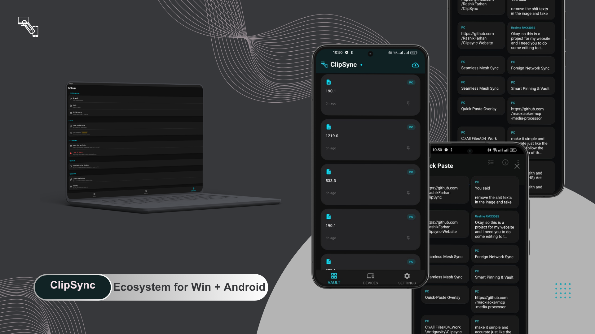

  
  
  <h1>ClipSync 📋</h1>
  
<strong>Decentralized, End-to-End Encrypted Clipboard Synchronization</strong>

  
  
  

  
<i>ClipSync is the ultimate privacy-first tool to bridge your devices. Effortlessly sync your clipboard between your Android smartphone and Windows PC with military-grade encryption and zero middle-men.</i>

---

## ✨ Key Features

- 🔒 **End-to-End Encrypted (E2EE)**: Your data is encrypted locally using curve25519/Ed25519 before it ever leaves your device. Only your paired devices have the keys to decrypt it.
- ⚡ **Decentralized P2P Sync**: Powered by **WebRTC**, ClipSync establishes a direct peer-to-peer connection between your devices. No central server stores your clipboard history.
- 📲 **Seamless Pairing**: Syncing is as simple as scanning a QR code. No complicated setup, no accounts, just instant connection.
- 🖥️ **Windows Integration**: Minimize to the system tray for a clutter-free experience. Support for **Start on Boot** via Windows Registry to ensure you're always synced.
- 📋 **One-Click Sync & Paste**: Android "Sync Now" notification action for manual triggers. Windows bridge supports **Automatic Paste Simulation** (Ctrl+V) for synced content.
- 🔄 **Anti-Echo Technology**: Intelligent guards prevent infinite clipboard loops between your synced devices.
- 🎨 **Modern Flutter UI**: A sleek, dark-themed interface built for performance and ease of use.

---

## 🚀 How It Works

ClipSync uses a modern networking stack to ensure speed and security:
1.  **Discovery**: Devices find each other via a lightweight signaling mechanism.
2.  **Handshake**: Ed25519 key exchange establishes a secure tunnel.
3.  **Synchronization**: Clipboard changes are pushed nearly instantaneously over WebRTC DataChannels.

---

## 📥 Getting Started

### Windows
1.  Download the latest `ClipSync_Setup_v0.1.0.exe` from the [Releases](https://github.com/RashikFarhan/ClipSync/releases) section.
2.  Run the installer and follow the prompts.
3.  Launch ClipSync and click "Pair Device".

### Android
1.  Download the `.apk` for your architecture (arm64, armv7, or x86_64) from the [Releases](https://github.com/RashikFarhan/ClipSync/releases) section.
2.  Install the APK and grant "Nearby Devices" and "Notification" permissions.
3.  Scan the QR code displayed on your PC to pair.

---

## 🎥 Video Tutorial

Want a step-by-step walkthrough? Watch the tutorial below:

<!-- 
  REPLACE THE LINK BELOW WITH YOUR YOUTUBE TUTORIAL 
  Current Placeholder: YouTube Link
-->

> [!TIP]
> **Don't have a video yet?** Input your YouTube link in the section above by editing the README and replacing `INSERT_YOUR_VIDEO_ID_HERE`.

---

## 🛠️ Built With

- [Flutter](https://flutter.dev) - UI Framework
- [WebRTC](https://webrtc.org/) - Peer-to-Peer Communication
- [MQTT](https://mqtt.org/) - Discovery Signaling
- [Cryptography](https://pub.dev/packages/cryptography) - E2EE Implementation

---

## 🤝 Contributing

Contributions are welcome! If you'd like to improve ClipSync, feel free to fork the repo and submit a PR. 

1.  Fork the Project
2.  Create your Feature Branch (`git checkout -b feature/AmazingFeature`)
3.  Commit your Changes (`git commit -m 'Add some AmazingFeature'`)
4.  Push to the Branch (`git push origin feature/AmazingFeature`)
5.  Open a Pull Request

---

## 📄 License

Distributed under the MIT License. See `LICENSE` for more information.

(<a href="#top">back to top</a>)

